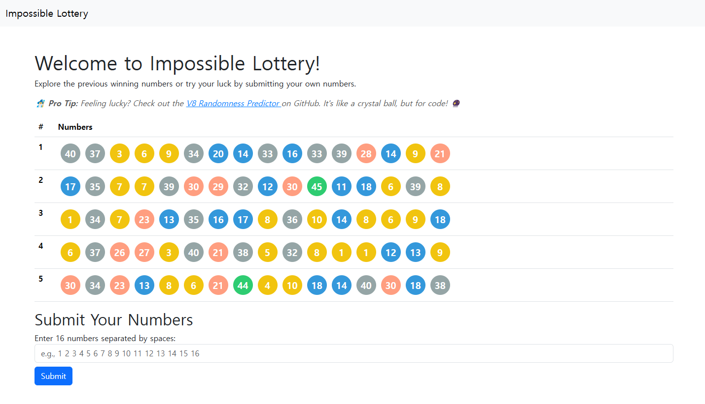
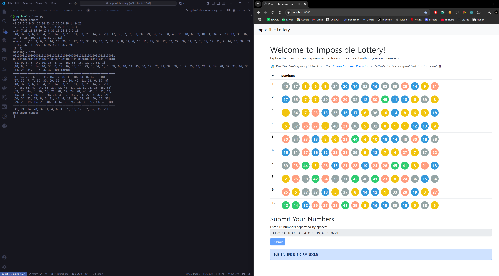
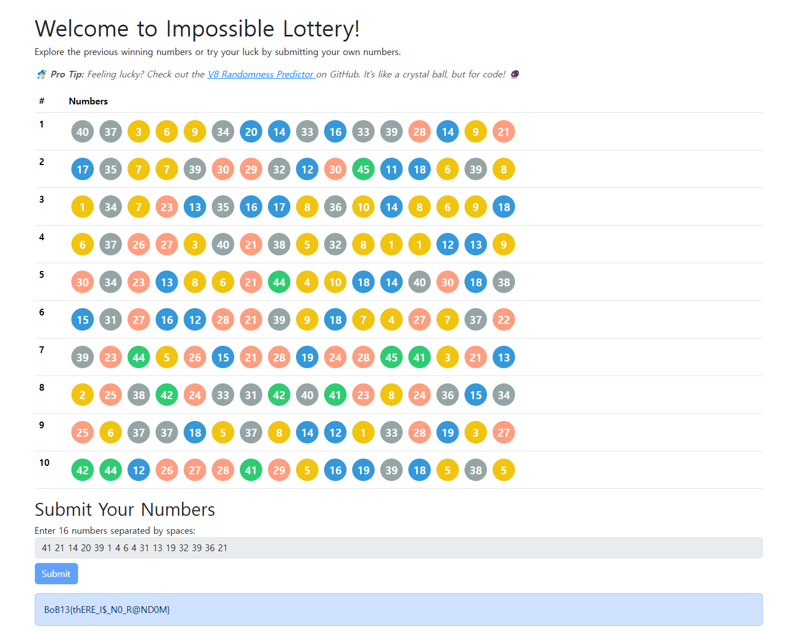

# Impossible Lottery

## Description

**인생 역전의 기회! 엄청난 부자가 될 수 있는 로또에 당첨될 준비가 되셨나요?**

1부터 45까지의 숫자 중 16개를 선택하여 입력하면, 서버에서 생성한 16개의 숫자와 일치하는지 확인합니다. 만약 모든 숫자가 일치한다면, 당신은 엄청난 행운의 주인공이 되어 숨겨진 보물을 손에 넣게 될 것입니다!

하지만, 쉬운 일은 아닙니다. 숫자는 완전히 무작위로 생성되기 때문에, 단순히 운에 의존해서는 당첨되기 어려울 것입니다. 혹시... 숫자 생성의 비밀을 밝혀낼 수 있다면? 😎

**지금 바로 도전하여 인생 역전의 꿈을 이루세요!**

## How to run

```sh
docker compose up -d
```



## Write-up

이 로또 게임은 단순히 운에 의존하는 게임이 아닙니다. 서버에서 숫자를 생성하는 데 사용되는 `xorshift128+` 알고리즘은 이전 상태를 기반으로 다음 상태를 계산하기 때문에 이전 숫자들을 알면 다음 숫자를 예측할 수 있습니다.

**1. 숫자 시퀀스 분석**

문제에서 주어진 5개의 이전 회차의 숫자 시퀀스를 분석하여 `xorshift128+` 알고리즘의 상태를 역산해야 합니다. 이를 위해 제공된 `solver.py` 코드를 사용할 수 있습니다.

**2. `solver.py` 코드 분석**

`solver.py` 코드는 다음과 같은 단계로 작동합니다.

- 숫자 시퀀스를 입력으로 받습니다.
- `xorshift128+` 알고리즘의 상태를 나타내는 두 개의 비트 벡터 `xorshift0` 및 `xorshift1`을 초기화합니다.
- 입력 시퀀스의 각 숫자에 대해 다음을 수행합니다.
  - 숫자의 범위를 기반으로 가능한 비트 값을 계산합니다.
  - 이전 상태를 기반으로 다음 상태를 계산합니다.
  - 계산된 비트 값을 `paralela` 목록에 추가합니다.
- `paralela` 목록에서 중복된 값을 제거하고 정렬합니다.
- `paralela` 목록의 첫 번째 두 요소를 출력합니다.
- `paralela` 목록에 1이 포함되어 있는지 확인합니다. 1이 포함되어 있으면 조건을 만족할 수 없으므로 "unsatisfiable" 메시지를 출력합니다.
- `paralela` 목록에 1이 포함되어 있지 않으면 상태를 계산합니다.
  - `st0ok` 및 `st1ok` 변수를 0으로 초기화합니다.
  - `paralela` 목록의 각 숫자에 대해 다음을 수행합니다.
    - 숫자가 2보다 작으면 건너뜁니다.
    - 숫자의 로그 값을 계산하여 `have` 집합에 추가합니다.
    - 숫자의 마지막 비트가 1이면 `st0ok` 또는 `st1ok` 변수에 해당 비트를 설정합니다.
  - `have` 집합에서 누락된 비트를 계산하여 `missing` 집합에 저장합니다.
  - `st0ok` 및 `st1ok` 변수의 이진 표현을 출력합니다.
  - `Math.state0` 및 `Math.state1` 변수를 `st0ok` 및 `st1ok` 값으로 설정합니다.
  - 다음 숫자 시퀀스를 예측하여 출력합니다.
  - 원래 숫자 시퀀스를 출력합니다.
- 계산된 상태를 사용하여 다음 숫자 시퀀스를 예측합니다.
- 예측된 숫자 시퀀스를 웹 페이지에 입력하여 플래그를 획득합니다. (예측된 숫자 시퀀스가 몇번째인지 확인하세요.)

`xorshift128+` 알고리즘에 대한 더욱 자세한 설명은 다음 레포지토리를 참고하세요. 👉 **[v8-randomness-predictor](https://github.com/KoYejune0302/v8-randomness-predictor)** 👈

**3. `solver.py` 코드 실행**

`solver.py` 코드를 사용하여 다음과 같이 숫자 시퀀스를 입력하고 실행합니다.



## Result


